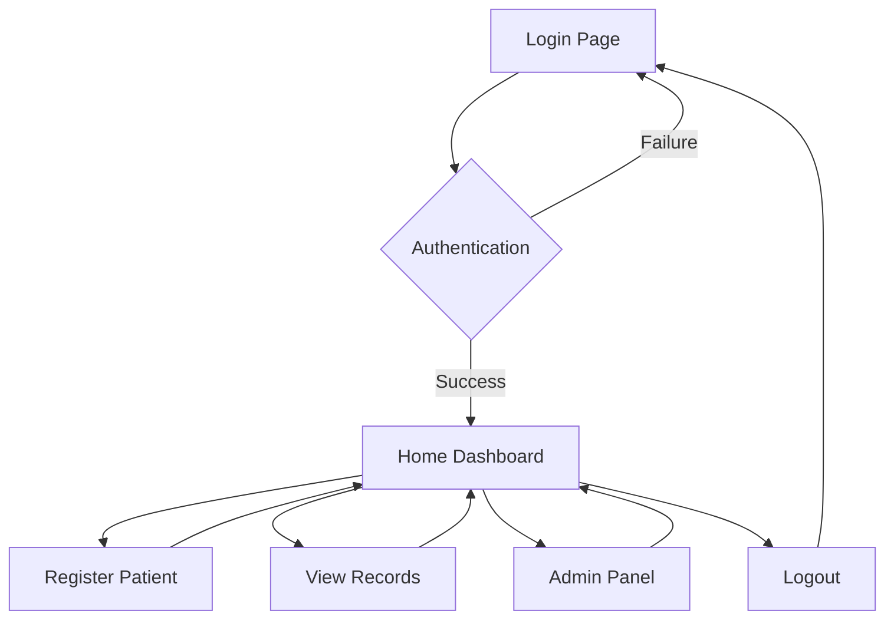

## 1. Product Overview
Optical Eye Clinic Patient Management System is a modern web application designed to streamline patient registration and record management for eye care professionals. The system provides secure authentication, intuitive patient registration, and comprehensive record management in a colorful, modern interface.

Target users include clinic staff, administrators, and healthcare providers who need efficient patient data management with a premium user experience.

## 2. Core Features

### 2.1 User Roles
| Role | Registration Method | Core Permissions |
|------|-------------------|------------------|
| Clinic Staff | Admin creation | Register patients, view records |
| Administrator | Admin creation | Full system access, user management |

### 2.2 Feature Module
The Optical Eye Clinic system consists of the following main pages:
1. **Login page**: Secure authentication with modern UI, validation, and error handling
2. **Home Dashboard**: Hero section, welcome message, quick action navigation cards
3. **Register Patient**: Clean form with patient details, validation, and submission
4. **View Records**: Patient list with search, filter, and detailed view capabilities
5. **Admin Panel**: User management, system settings, and analytics overview

### 2.3 Page Details
| Page Name | Module Name | Feature description |
|-----------|-------------|---------------------|
| Login page | Authentication form | Username/password input with validation, show/hide password toggle, remember me option, gradient background with card layout |
| Login page | Error handling | Display validation errors and authentication failures with user-friendly messages |
| Home Dashboard | Hero section | Gradient background, clinic branding, welcome message with user name |
| Home Dashboard | Quick actions | Three cards: Register Patient, View Records, Admin Panel with hover animations |
| Home Dashboard | Navigation | Logout button in top right, user info display |
| Register Patient | Patient form | Full name, phone, address, visit date fields with proper validation |
| Register Patient | Form submission | Save patient data, show success message, clear form after submission |
| View Records | Patient list | Display all patients in card/table format with search functionality |
| View Records | Record details | Click to view complete patient information and visit history |
| Admin Panel | User management | Add/edit/delete clinic staff accounts |
| Admin Panel | System overview | Basic analytics and system usage statistics |

## 3. Core Process
**Authentication Flow**: User accesses any page → System checks authentication → If not authenticated, redirect to /login → User enters credentials → Validate credentials → If valid, create session and redirect to /home → Display user info and dashboard

**Patient Registration Flow**: From dashboard, click "Register Patient" → Fill patient form → Validate all fields → Submit form → Save to database → Show success message → Return to dashboard or continue registration

**Record Viewing Flow**: Click "View Records" → Load all patients → Display in organized layout → Search/filter patients → Click individual record → View detailed patient information

## 4. User Interface Design

### 4.1 Design Style
- **Primary Colors**: Deep blue (#1e40af) to purple (#7c3aed) gradient
- **Secondary Colors**: Soft teal (#0891b2), warm orange (#f59e0b)
- **Button Style**: Rounded corners (8-12px), subtle shadows, gradient backgrounds
- **Typography**: Inter font family, 16px base size, clear hierarchy
- **Layout**: Card-based design, generous white space, smooth animations
- **Icons**: Modern line icons, consistent stroke width, colorful accents

### 4.2 Page Design Overview
| Page Name | Module Name | UI Elements |
|-----------|-------------|-------------|
| Login page | Authentication card | Centered card with glass-morphism effect, gradient background, clinic logo, rounded inputs with icons |
| Home Dashboard | Hero section | Full-width gradient banner, animated welcome text, floating action cards with hover effects |
| Home Dashboard | Quick actions | Three colorful cards with icons, smooth scale animations on hover, drop shadows |
| Register Patient | Form container | Clean white card, grouped form fields, colorful submit button, inline validation messages |
| View Records | Record cards | Grid layout of patient cards, profile icons, status badges, search bar with filter options |
| Admin Panel | Admin cards | Professional layout with data tables, action buttons, user avatars, statistics cards |

### 4.3 Responsiveness
Mobile-first responsive design with breakpoints at 640px, 768px, and 1024px. All pages adapt seamlessly from mobile to desktop with touch-optimized interactions, collapsible navigation, and appropriately sized touch targets.

### 4.4 Animations
Smooth transitions using CSS animations: fade-in for page loads, slide-up for cards, scale on hover, subtle parallax in hero sections. Animation duration: 200-400ms with ease-in-out timing functions.