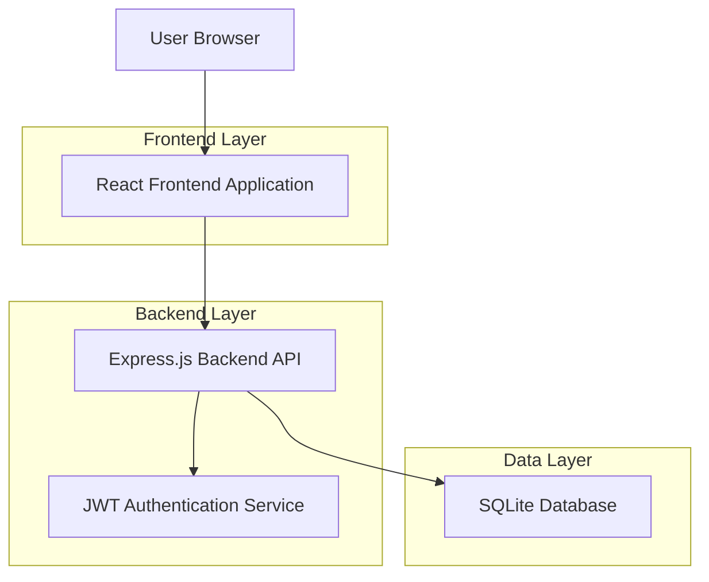
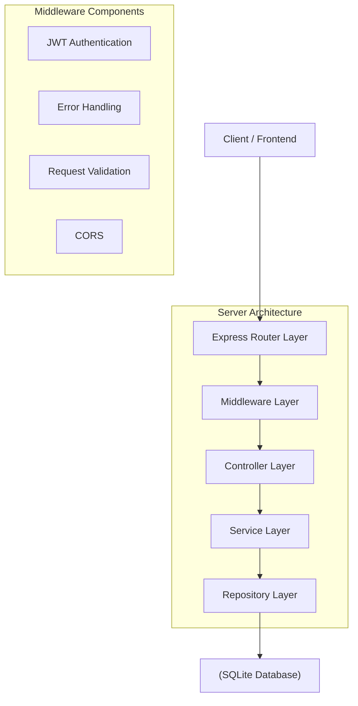
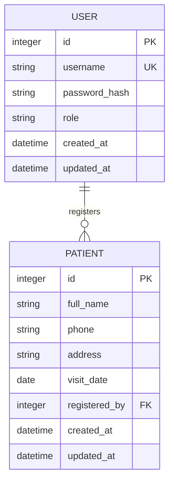

## 1. Architecture design



## 2. Technology Description
- Frontend: React@18 + tailwindcss@3 + vite
- Initialization Tool: vite-init
- Backend: Node.js@18 + Express@4
- Database: SQLite3 with better-sqlite3 driver
- Authentication: JWT (jsonwebtoken) with bcrypt for password hashing

## 3. Route definitions
| Route | Purpose |
|-------|---------|
| /login | Authentication page with username/password form |
| /home | Main dashboard with quick action cards |
| /register | Patient registration form |
| /records | View and search patient records |
| /admin | Administrative panel for user management |
| /api/auth/login | Backend authentication endpoint |
| /api/auth/logout | Backend logout endpoint |
| /api/patients | CRUD operations for patient data |
| /api/users | User management endpoints (admin only) |

## 4. API definitions

### 4.1 Authentication API

**Login Endpoint**
```
POST /api/auth/login
```

Request:
| Param Name | Param Type | isRequired | Description |
|------------|------------|------------|-------------|
| username | string | true | Clinic staff username |
| password | string | true | User password (plain text) |

Response:
| Param Name | Param Type | Description |
|------------|------------|-------------|
| token | string | JWT token for authentication |
| user | object | User data (id, username, role) |
| status | string | Success/error status |

Example
```json
{
  "username": "clinic_staff",
  "password": "secure_password"
}
```

**Patient Registration Endpoint**
```
POST /api/patients
```

Request:
| Param Name | Param Type | isRequired | Description |
|------------|------------|------------|-------------|
| fullName | string | true | Patient's full name |
| phone | string | true | Contact phone number |
| address | string | true | Residential address |
| visitDate | string | true | Appointment date (ISO format) |

Response:
| Param Name | Param Type | Description |
|------------|------------|-------------|
| patientId | number | Unique patient identifier |
| status | string | Success/error status |
| message | string | Response message |

## 5. Server architecture diagram



## 6. Data model

### 6.1 Data model definition



### 6.2 Data Definition Language

**Users Table**
```sql
CREATE TABLE users (
    id INTEGER PRIMARY KEY AUTOINCREMENT,
    username VARCHAR(50) UNIQUE NOT NULL,
    password_hash VARCHAR(255) NOT NULL,
    role VARCHAR(20) DEFAULT 'staff' CHECK (role IN ('staff', 'admin')),
    created_at DATETIME DEFAULT CURRENT_TIMESTAMP,
    updated_at DATETIME DEFAULT CURRENT_TIMESTAMP
);

-- Create index for faster username lookup
CREATE INDEX idx_users_username ON users(username);

-- Insert default admin user (password: admin123)
INSERT INTO users (username, password_hash, role) 
VALUES ('admin', '$2b$10$rQZ9qF8xL6KoF3yH9Jl.XuK5vQ2N8mP4RtQ6g5vWs9P8p7RtK9CuK', 'admin');
```

**Patients Table**
```sql
CREATE TABLE patients (
    id INTEGER PRIMARY KEY AUTOINCREMENT,
    full_name VARCHAR(100) NOT NULL,
    phone VARCHAR(20) NOT NULL,
    address TEXT NOT NULL